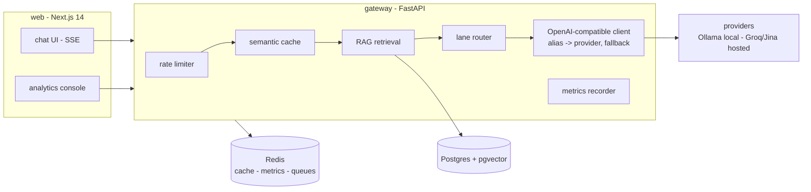

# TokenRoute

[](https://github.com/rizvihasan/tokenroute/actions/workflows/ci.yml)
[](LICENSE)
[](https://tokenroute.vercel.app)

**The LLM gateway that cuts your bill, not just your logs.** TokenRoute sits between your app and any OpenAI-compatible provider: it routes easy prompts to cheap models, falls back when a provider fails, and answers repeat questions from a **semantic cache** for $0 - with a live analytics console built in, free and self-hostable, no paid observability tier.

```
your app  -->  TokenRoute  -->  cheap lane (fast model)
                  |          ->  cloud lane (strong model)
                  |          ->  semantic cache (paraphrase = $0, ~0 ms)
                  +-> console: cost, latency, lane, cache hit rate - live
```

## Why not Portkey / LiteLLM / Langfuse?

- **Portkey's** free self-host has no observability - the console is the $49/mo upsell. TokenRoute ships the full console free.
- **LiteLLM** is a great router with no UI; its budget counters drift under concurrency ([documented](https://theorydelta.com/findings/llm-gateway-silent-failures)) and the official image wants ~4Gi RAM per worker. TokenRoute meters every request in Redis and runs in ~200MB.
- **Langfuse** is observability without a gateway, and self-hosting needs Postgres + ClickHouse + Redis + S3. TokenRoute is gateway + console in one compose file.
- **Helicone** was acquired and frozen in March 2026.

Full comparison: [docs/PRODUCT.md](docs/PRODUCT.md)

## Quickstart (< 5 min, Docker)

```bash
git clone https://github.com/rizvihasan/tokenroute && cd tokenroute
cp .env.example .env        # works as-is for local-only
make up                     # builds and starts the full stack
make models                 # one-time: pulls llama3.1:8b + nomic-embed (~5GB)
```

Chat UI at http://localhost:3000, ops console at http://localhost:3000/console, gateway API at http://localhost:8000.

No Docker / no GPU? Point the gateway at hosted free tiers instead - set `GROQ_API_KEY` + `JINA_API_KEY` in `.env` (both have free tiers) and run the gateway alone; the routing, cache, and console story is identical. See [docs/ARCHITECTURE.md](docs/ARCHITECTURE.md#providers).

## Use it from your app

Any OpenAI-compatible client works:

```python
from openai import OpenAI
client = OpenAI(base_url="http://localhost:8000/v1", api_key="not-needed")
client.chat.completions.create(model="chat-local",   # or "chat-cloud", or "provider:model"
                               # e.g. "openai:gpt-4o-mini", "anthropic:claude-sonnet-4-5",
                               # "gemini:gemini-2.5-flash" (platform env key or tenant BYOK)
                               messages=[{"role": "user", "content": "Explain p95 latency"}])
```

`chat-local` / `chat-cloud` force a lane; POST `/chat` (SSE) gets you the full pipeline - rate limit, cache lookup, RAG, lane heuristic, streamed tokens, and per-request cost/latency metering.

## What's inside

| Piece | What it does |
| --- | --- |
| Lane router | Cheap-lane-first heuristic (length, reasoning markers, code, retrieved-context size); automatic cross-lane fallback on error/timeout |
| Semantic cache | Prompt embeddings + cosine similarity (threshold 0.92); a paraphrase of a past question returns instantly for $0 |
| Analytics console | Live request feed, cache hit rate, TTFT p50/p95, lane distribution, notional spend - served by `GET /metrics/console` |
| RAG | Chunker, embeddings, pgvector retrieval, context-grounded prompting (`POST /ingest` your docs) |
| Evals | Ragas runner over a golden set, one click from the console |
| Metrics | Per-request cost, TTFT, tokens/sec, lane - counters in Redis, derived at read time |
| Function calling | `tools`/`tool_choice` pass-through with streamed `tool_calls`; tool-result messages supported |
| Guardrails | High-precision injection filter + Luhn-checked card redaction; `GUARDRAILS_MODE=off/log/block`, triggers logged to the console |
| RBAC | Scoped keys (`chat`, `metrics`); `/v1/usage` reports a key's spend vs cap |
| Advanced RAG | Hybrid vector + keyword retrieval (RRF) with Jina rerank; degrades gracefully per leg |
| MCP server | `POST /mcp` JSON-RPC: `tokenroute_chat`, `tokenroute_usage` - Claude/Cursor call the gateway as a tool |
| Billing (structure) | Free/Pro plans, subscriptions, Razorpay-first checkout + signed webhooks (Stripe alt); dormant until credentials are set |

## Architecture



Design decisions and data flow: [docs/ARCHITECTURE.md](docs/ARCHITECTURE.md)

## Live demo ($0 hosted)

https://tokenroute.vercel.app - console at [/console](https://tokenroute.vercel.app/console).
Runs on free tiers (Vercel + Render + Upstash + Neon + Groq + Jina); services sleep after 15 min idle, so the first message can take ~30-60s. The hosted demo swaps local Ollama for Groq's gpt-oss models (no free tier runs an 8B quantized model); the routing/cache/metrics story is identical.

Want your own key on the hosted gateway? Sign in with Google at
[/login](https://tokenroute.vercel.app/login) and create one on the dashboard
(optional monthly budget cap; you can also plug in your own OpenAI/Anthropic/
Gemini/Groq key and your usage bills to your provider, not the platform).
Then point any OpenAI SDK at `https://tokenroute-gateway.onrender.com/v1`
with the key as the Bearer token.

## Repo layout

```
gateway/    FastAPI: /chat (SSE), /v1 (OpenAI-compatible), /ingest, /evals, /metrics
  app/services/   cache, routing, rag, db, llm, store, tracing
  app/workers/    RQ jobs (ingest, evals)
  evals/          golden set + Ragas runner
  tests/          unit tests (no services required)
web/        Next.js 14: chat + analytics console
litellm/    local-dev proxy config (Ollama path)
docs/       PRODUCT.md (positioning) - ARCHITECTURE.md (internals)
```

## Tests

```bash
make test        # gateway unit tests, no services required
cd web && npm install && npm run typecheck && npm run build
```

## Roadmap

Shipped: multi-tenancy (keys, budgets, RBAC scopes, BYOK), Google sign-up +
key dashboard, 4-provider routing, function calling, guardrails, hybrid RAG
+ rerank, MCP server, billing structure (plug in Razorpay/Stripe to activate).

- Learned lane router (replacing the heuristic)
- Bedrock/OpenRouter presets
- Streaming usage metering for WebSocket/agent workloads
- Billing go-live (needs a provider account - structure is ready)

## Honest limitations

- Semantic cache lookup is a linear scan over a capped entry set - fine at personal/team scale; the interface isolates a swap to pgvector or Redis vector search.
- The lane heuristic is intentionally simple and inspectable.
- Single-node compose stack; horizontal scale is future work, not claimed.

## Contributing

Issues and PRs welcome - see [CONTRIBUTING.md](CONTRIBUTING.md).

## License

Apache 2.0 - [LICENSE](LICENSE). Self-host the whole thing, free, forever.
