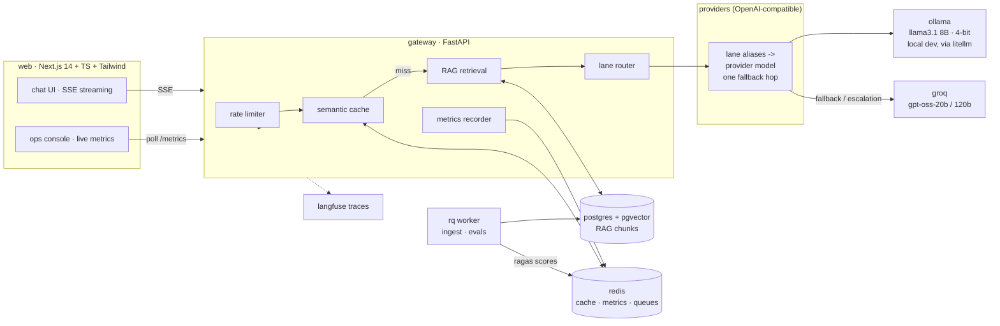

# TokenRoute

A production-grade LLM inference gateway with a RAG chat app and a live ops console - built to show the full inference-engineering loop, not just a demo prompt.

One-line: a ChatGPT-style app where you own the inference layer. A local quantized model serves cheap queries, a cloud model takes the hard ones, every response is semantically cached, traced, and evaluated, and its cost and latency are live on a dashboard.

## Architecture



## What it demonstrates

| Topic | Where |
| --- | --- |
| Quantized local model serving | Ollama running `llama3.1:8b-instruct-q4_K_M` behind an OpenAI-compatible API |
| Inference routing + fallback | Lane router in the gateway: cheap-lane-first heuristic, automatic cross-lane fallback on error/timeout, per-IP rate limits. Local dev puts a LiteLLM proxy in front of Ollama; the $0 hosted demo routes to Groq directly (the official LiteLLM image needs ~4Gi/worker and could not stay up on a 512MB free-tier instance) |
| Semantic response caching | Prompt embeddings + cosine similarity in Redis; a paraphrase hit returns the answer for $0 and ~0 ms |
| RAG | Chunker, embeddings (`nomic-embed-text`), pgvector retrieval, context-grounded prompting |
| Streaming UX | True token-by-token SSE end to end: FastAPI generator -> Next.js route proxy -> browser `ReadableStream` |
| Scaling patterns | RQ background queues for ingestion and evals, fixed-window rate limiting, spend caps at the proxy |
| Observability | TTFT, tokens/sec, cost, cache-hit rate, lane breakdown in Redis; optional Langfuse traces per request |
| Evals | 20-pair golden set scored by Ragas (faithfulness, answer relevancy, context precision) as a queued batch job |
| Production frontend | Next.js 14 App Router, strict TypeScript, streaming chat + ops console |

## Quickstart

Prereqs: Docker, ~8 GB free RAM (an 8B 4-bit model plus the stack). On a smaller machine, edit `LOCAL_MODEL` in `.env` to `ollama/llama3.2:3b-instruct-q4_K_M`.

```bash
cp .env.example .env        # add OPENAI_API_KEY for the cloud fallback (optional)
make up                     # build + start all 7 services
make models                 # one-time model pull into ollama (~5 GB)
```

Then:

- Chat: http://localhost:3000
- Ops console: http://localhost:3000/console
- Gateway API: http://localhost:8000/docs

Seed the RAG store and run evals:

```bash
curl -X POST localhost:8000/ingest -H 'content-type: application/json' -d '{
  "doc_id": "design-notes",
  "text": "TokenRoute routes cheap queries to a local quantized model ..."
}'

curl -X POST localhost:8000/evals -H 'content-type: application/json' -d '{"lane": "local"}'
# watch scores appear on the console
```

Tracing: create a free Langfuse cloud project, drop the keys into `.env`, restart the gateway. Every chat request gets a trace with lane, cost, and latency.

## Design decisions

- **One OpenAI-compatible client, env-swappable providers.** The app talks to any OpenAI-compatible endpoint through one small client; lane aliases resolve to (base URL, key, model) from env. Local dev points at the LiteLLM container for the Ollama path, the hosted demo points straight at Groq/Jina - swapping or adding a model is an env edit, not a code change.
- **Semantic cache in front of everything.** Exact-match caches miss on every paraphrase. Embedding the prompt and matching on cosine similarity (default threshold 0.92) makes "what is the cache threshold?" and "how high is the cache cutoff?" the same question. Known limit: the scan is O(N) over a capped entry set - fine at personal scale; the interface isolates the swap to pgvector/Redis vector search.
- **Cheap lane by default.** The routing heuristic keeps short, simple, retrieval-grounded prompts on the local model and escalates long, reasoning-heavy, or code-heavy ones. Fallbacks at the proxy cover failure; the heuristic covers cost.
- **Heavy work off the request path.** Ingestion and eval runs are RQ jobs. The chat path never chunks a document or waits for Ragas.
- **Metrics in Redis, not a database.** Counters and sums in hashes (global + per-conversation); averages and hit rates are derived at read time. Zero extra infrastructure.

## Repo layout

```
gateway/    FastAPI service: /chat (SSE), /ingest, /evals, /metrics
  app/services/   cache, routing, rag, db, llm, store, tracing
  app/workers/    RQ jobs (ingest, evals)
  evals/          golden set + Ragas runner
  tests/          unit tests (no services required)
web/        Next.js 14 frontend: chat + ops console
litellm/    proxy config (models, fallbacks, budgets)
```

## Tests

```bash
cd gateway && pip install -r requirements.txt && python -m pytest tests -q
cd web && npm install && npm run typecheck && npm run build
```

## Deploying the demo ($0)

Live demo: https://tokenroute.vercel.app (gateway https://tokenroute-gateway.onrender.com).
Free services sleep after 15 min idle, so the first message can take ~30-60s.

The compose stack is the real thing; a hosted demo is wired for free tiers:

- **web** -> Vercel (root dir `web/`, one env var: `GATEWAY_INTERNAL_URL`);
  includes the analytics console at `/console` (lane distribution, cache hit
  rate, TTFT percentiles, live request feed - all derived from the gateway's
  request log in Redis)
- **gateway** -> Render free web service (Docker, `RUN_WORKER=1` runs the RQ
  worker in-process; free tiers have no background workers)
- **Redis** -> Upstash free; **Postgres** -> Neon free (pgvector built in)
- **models** -> Groq (OpenAI-compatible) serves both lanes: `openai/gpt-oss-20b`
  as the cheap lane and `openai/gpt-oss-120b` as the escalation lane. (Groq moved
  the Llama 3.x models to enterprise-only; gpt-oss is their current free-tier family.)
  Embeddings: Jina `jina-embeddings-v3` direct. The hosted demo originally ran a
  LiteLLM proxy container; it OOMed repeatedly on Render's 512MB free tier (its
  docs recommend 4Gi/worker), so routing moved into the gateway and the proxy was
  cut from the deployed stack. `litellm/` remains for local dev.
  Embeddings via Jina v3 (OpenAI-compatible). Set `EMBEDDING_DIM=1024`.
- `render.yaml` is the blueprint; CI runs in GitHub Actions (`.github/workflows/ci.yml`).

Honest tradeoff: no free tier runs a quantized 8B model, so the deployed demo
swaps local Ollama for Groq's hosted gpt-oss models - the routing, fallback,
caching, and metrics story is identical, and the local-quantized path stays one
`docker compose up` away. Free Render services sleep after 15 min idle; the
first request after idle cold-starts (~30-60s).

## Honest limitations

- Semantic cache lookup is a linear scan (documented above).
- The lane heuristic is intentionally simple and inspectable; a learned router is the obvious next step.
- Ragas judging uses the cloud model, so eval runs need `OPENAI_API_KEY`.
- Single-node compose stack; the scaling story is the queue + proxy patterns, not horizontal replicas.
